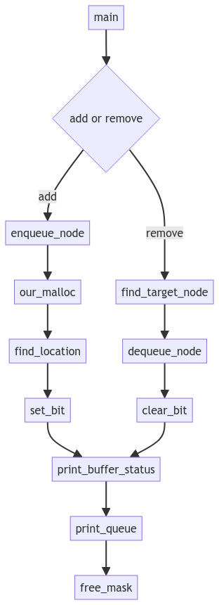
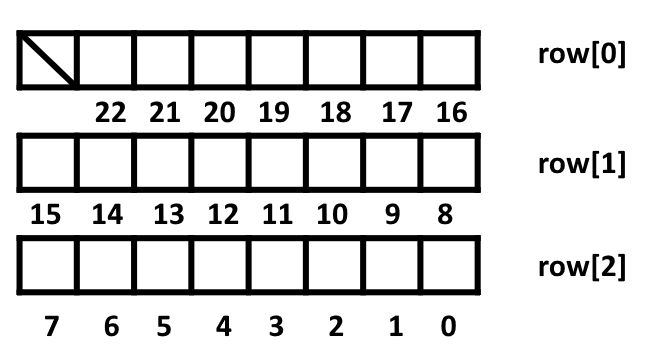

# W14 designed program flow

## program flow



## byte_buf_mask放置方式
假設NUM_BYTE_BUF為23:  



## 變數說明
```C
int rows = NUM_BYTE_BUF / 8 + 1 - (NUM_BYTE_BUF % 8 ==0? 1:0);  
//計算需要幾個row，若NUM_BYTE_BUF為8的倍數，則須額外-1
typedef struct {
    int row;
    int location;
}storageLocation;
//創建新的結構，去存find_location()回傳的目標row跟location
```

## function 說明

### void create_mask (void)
完成malloc後對byte_buf_mask進行初始化，要判斷 NUM_BYTE_BUF 是不是8的倍數，如果不是，要對第0 row特殊處理，以23為例，餘數remain為7，所以第0 row的最高位元不給使用。  
255 - pow(2,remain)+1  
11111111 - 10000000 + 00000001 = 10000000
```C
void create_mask (void)
{
    byte_buf_mask = (unsigned char **)malloc(rows*sizeof(unsigned char *));
    for(int i=0;i<rows;i++)
    {
        byte_buf_mask[i] = (unsigned char *) malloc(sizeof(unsigned char));
    }

    for(int i=0;i<rows;i++)   // initial
    {
        if(i==0 && is_multiple_of_eight != 1) // 如果不是8的倍數，對第0 row特殊處理
        {
            *byte_buf_mask[i] = 255 - pow(2,remain)+1;  //將不會用到的bit設1
        }
        else
        {
            *byte_buf_mask[i] = 0;
        }
    }
    printf ("\n");
}
```

### int print_buffer_status (void)
印出buffer時，從0開始印，如果NUM_BYTE_BUF不是8的倍數，第0 row要做特殊處理，使用餘數判斷mask要右移多少位元在開始print，print的同時去計算0的數量當作剩餘的記憶體空間，在最後進行回傳。
```C
int print_buffer_status (void)
{
    int i,j;
    int currentBit;
    int remainMemorySpace = 0;
    unsigned char mask = 0x80;

    printf ("      byte_buf_mask: ");
    
    for(i = 0; i<rows; i++)
    {
        if(i==0 && remain != 0)  //first rows and NUM_BYTE_BUF not a multiple of 8
        {
            mask = mask >> (8 - remain); //將mask移到指定位置開始
            for (j = 0; j< remain; j++)
            {
                currentBit = (*byte_buf_mask[i] & mask) >> (remain-j-1);
                printf ("%d ", currentBit); //印出first row
                if(currentBit == 0)
                {
                    remainMemorySpace++;  //在printf的同時計算剩餘的空間數量
                }
                mask = mask >> 1;
            }
            printf(", ");
            mask = 0x80; //reset mask
        }
        else
        {
            for (j = 0; j< 8; j++)
            {
                currentBit = (*byte_buf_mask[i] & mask) >> (7-j);
                printf ("%d ", currentBit);
                if(currentBit == 0)
                {
                    remainMemorySpace++; //在printf的同時計算剩餘的空間數量
                }
                mask = mask >> 1;
            }
            printf(", ");
            mask = 0x80; //reset mask
        }
    }
    printf ("\n");
    return remainMemorySpace;
}
```

### storageLocation find_location(unsigned char **buf, int data_type)
根據輸入的data_type去尋找連續可用的空間，  
如果找到的話，會回傳該空間的起始位置(row跟location)，  
若找不到，則將row跟location設為-1並回傳。
```C
storageLocation find_location(unsigned char **buf, int data_type)
{
    int space = 0;
    int currentRow = rows - 1;
    unsigned char mask = 0x01;
    storageLocation result;
    int cnt = 0;

    while(currentRow >= 0)  //從最大row開始(位置:0~7)
    {
        for(int bitIndex=0;bitIndex<8;bitIndex++)
        {
            if((mask & *buf[currentRow]) == 0)
            {
                space++;  //計算空間數
                if(space == data_type)
                {
                    while((bitIndex - data_type + 1) < 0)
                    {
                        cnt++;
                        bitIndex += 8;
                    }
                    result.row = currentRow + cnt; //連續空間開始的 row
                    result.location = bitIndex - data_type + 1; //該row的location(0~7)
                    return  result;
                }
            }
            else
            {
                space = 0;  //reset counter
            }
            mask = mask << 1;
        }
        currentRow--;
        mask = 0x01;
    }
    result.row = -1;
    result.location = -1;
    return result;
}
```

### void set_bit(unsigned char **mask, int row, int location, int data_type)
從傳入的row跟location開始，放置data_type個1，當set == 0x80時，代表該row已設定完，跳至下一row繼續執行，clear_bit也同理。

```C
void set_bit(unsigned char **mask, int row, int location, int data_type)
{
    unsigned char set = 0x01;

    set = set << location;  //go to target bit
    
    for(int i=0;i<data_type;i++) //要做幾次將bit設1
    {
        *mask[row] = *mask[row] | set;
        if(set == 0x80)
        {
            set = 0x01; //reset
            row = row - 1;
        }
        else
        {
            set = set << 1;
        }
    }
}
```